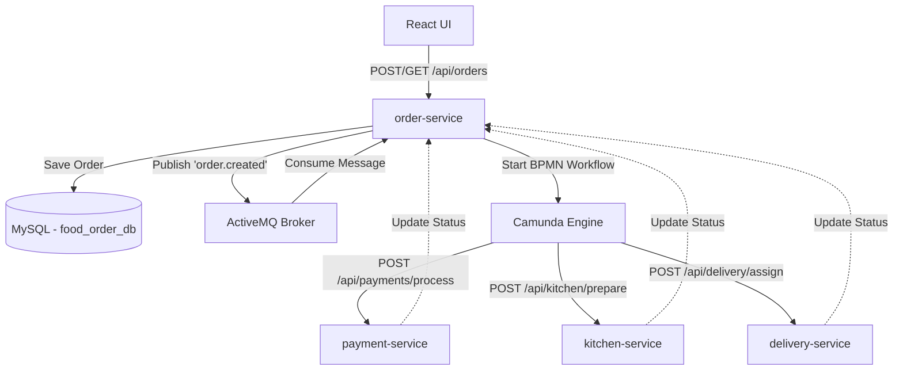
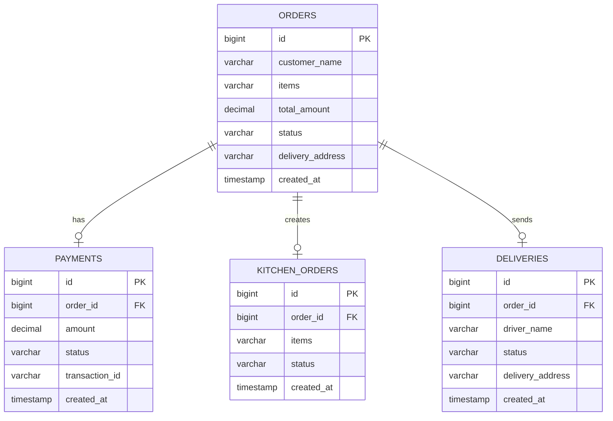
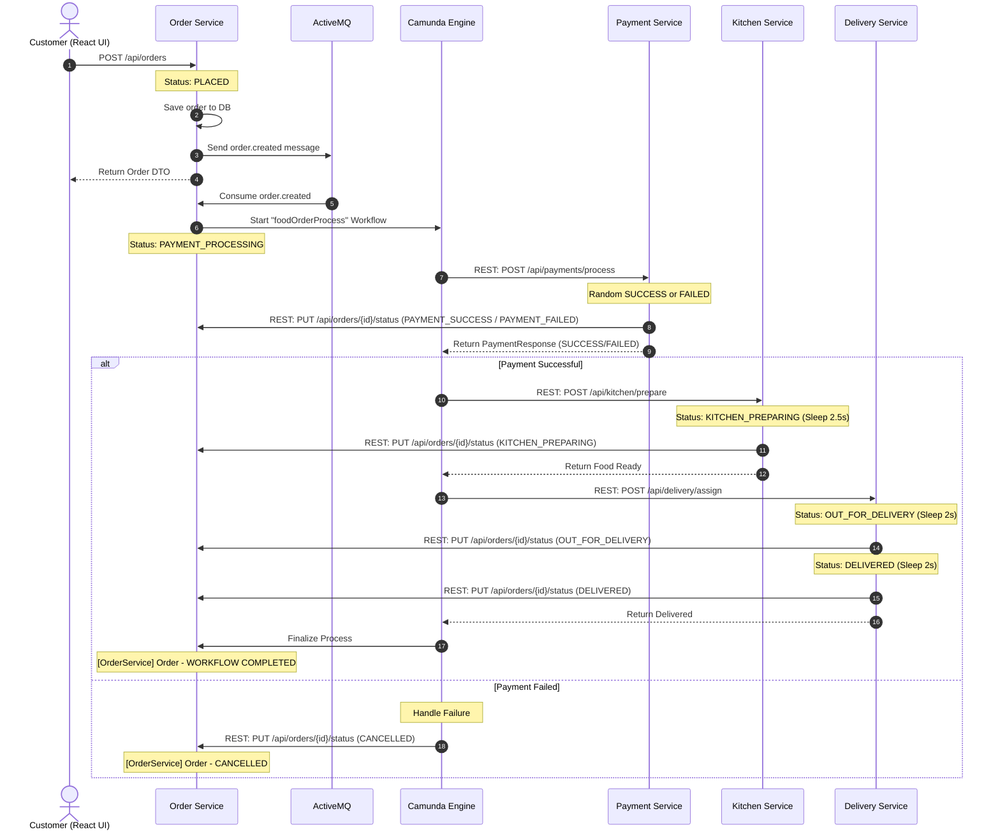

# Online Food Order Processing System

A production-ready microservice-based Online Food Order Processing System designed with Java 21, Spring Boot 3.x, Camunda BPM 7, Apache ActiveMQ Classic, MySQL, and a modern React.js frontend styled with Bootstrap.

---

## Table of Contents
1. [Architecture Overview](#architecture-overview)
2. [Database Design & ER Diagram](#database-design--er-diagram)
3. [Sequence Diagram](#sequence-diagram)
4. [BPMN Workflow](#bpmn-workflow)
5. [Project Directory Structure](#project-directory-structure)
6. [API Specifications](#api-specifications)
7. [Running Instructions](#running-instructions)
8. [Log Output Example](#log-output-example)
9. [Frontend Screenshots Instructions](#frontend-screenshots-instructions)

---

## Architecture Overview

The system runs as an event-driven orchestration pipeline. Below is the service structure and component mapping:



*   **order-service** (`8081`): Orchestrator hosting the Camunda workflow engine, MySQL database connectivity for orders, and the ActiveMQ broker integration.
*   **payment-service** (`8082`): Simulates payment gateways, returns success/failure states with randomized execution (80% success rate).
*   **kitchen-service** (`8083`): Models kitchen food preparation with simulated processing sleep timers.
*   **delivery-service** (`8084`): Assigns couriers, updates statuses to transit, and delivers orders with sleep delays.
*   **react-frontend** (`5173`): Interactive customer tracking panel that polls order status updates every 2 seconds.

---

## Database Design & ER Diagram

We leverage a unified MySQL database running the schema `food_order_db`. Each microservice interacts exclusively with its designated table structure:



*   Refer to [schema.sql](file:///c:/Users/acer/Downloads/food-develier/schema.sql) for SQL table definitions, constraints, indices, and foreign key relations.

---

## Sequence Diagram

The diagram below outlines the transactional sequence and lifecycle of an order:



---

## BPMN Workflow

The business process is executed inside the Camunda engine according to the model defined in `food-order-flow.bpmn`:

1.  **Start Event**: Triggered by consuming the queue event.
2.  **Process Payment (Service Task)**: Resolves through the `ProcessPaymentDelegate` calling `payment-service`.
3.  **Exclusive Gateway (Is Payment Success?)**: Evaluates process variable `${paymentStatus == 'SUCCESS'}`.
    *   **Yes Path**: Moves to **Prepare Food** service task.
    *   **No Path**: Moves to **Handle Payment Failure** service task (cancels the order).
4.  **Prepare Food (Service Task)**: Resolves through `PrepareFoodDelegate` calling `kitchen-service`.
5.  **Deliver Order (Service Task)**: Resolves through `DeliverOrderDelegate` calling `delivery-service`.
6.  **Complete Workflow (Service Task)**: Resolves through `CompleteWorkflowDelegate` logging the final process metadata.

---

## Project Directory Structure

```
food-develier/
├── docker-compose.yml
├── pom.xml
├── schema.sql
├── README.md
├── order-service/
│   ├── pom.xml
│   └── src/main/
│       ├── java/com/food/order/
│       │   ├── OrderServiceApplication.java
│       │   ├── config/ActiveMQConfig.java
│       │   ├── controller/OrderController.java
│       │   ├── delegate/
│       │   │   ├── CompleteWorkflowDelegate.java
│       │   │   ├── DeliverOrderDelegate.java
│       │   │   ├── HandlePaymentFailureDelegate.java
│       │   │   ├── PrepareFoodDelegate.java
│       │   │   └── ProcessPaymentDelegate.java
│       │   ├── dto/
│       │   │   ├── OrderCreatedEvent.java
│       │   │   ├── OrderRequest.java
│       │   │   └── OrderResponse.java
│       │   ├── entity/Order.java
│       │   ├── exception/
│       │   │   ├── GlobalExceptionHandler.java
│       │   │   └── ResourceNotFoundException.java
│       │   ├── messaging/
│       │   │   ├── OrderEventConsumer.java
│       │   │   └── OrderEventProducer.java
│       │   └── service/OrderService.java
│       └── resources/
│           ├── application.properties
│           └── food-order-flow.bpmn
├── payment-service/
│   ├── pom.xml
│   └── src/main/
│       ├── java/com/food/payment/
│       │   ├── PaymentServiceApplication.java
│       │   ├── controller/PaymentController.java
│       │   ├── dto/
│       │   │   ├── PaymentRequest.java
│       │   │   └── PaymentResponse.java
│       │   ├── entity/Payment.java
│       │   └── repository/PaymentRepository.java
│       └── resources/application.properties
├── kitchen-service/
│   ├── pom.xml
│   └── src/main/
│       ├── java/com/food/kitchen/
│       │   ├── KitchenServiceApplication.java
│       │   ├── controller/KitchenController.java
│       │   ├── dto/
│       │   │   ├── KitchenRequest.java
│       │   │   └── KitchenResponse.java
│       │   ├── entity/KitchenOrder.java
│       │   └── repository/KitchenOrderRepository.java
│       └── resources/application.properties
├── delivery-service/
│   ├── pom.xml
│   └── src/main/
│       ├── java/com/food/delivery/
│       │   ├── DeliveryServiceApplication.java
│       │   ├── controller/DeliveryController.java
│       │   ├── dto/
│       │   │   ├── DeliveryRequest.java
│       │   │   └── DeliveryResponse.java
│       │   ├── entity/Delivery.java
│       │   └── repository/DeliveryRepository.java
│       └── resources/application.properties
└── react-frontend/
    ├── package.json
    ├── vite.config.js
    ├── src/
    │   ├── App.jsx
    │   ├── index.css
    │   └── main.jsx
    └── index.html
```

---

## API Specifications

Detailed low level API endpoints are described in the [database_design.md](file:///C:/Users/acer/.gemini/antigravity-ide/brain/1c10e148-38d8-47ee-a196-e5fa28cd56cb/database_design.md) artifact.

---

## Running Instructions

Follow these steps to run the complete environment:

### Prerequisites
*   Java 21+ installed (verified on Java 25).
*   Node.js (LTS version) installed.
*   *Optional*: Docker and Docker Compose (if not present, the system defaults to in-memory H2 databases and embedded VM ActiveMQ brokers).
*   *Optional*: Maven (if not present, the script downloads and executes a local wrapper).

### 1. Automated Quick Start (Self-Contained / Docker-less Mode)
You can launch the entire ecosystem (all 4 microservices + React client) with a single command. Open a PowerShell window in the project root and execute:
```powershell
powershell -ExecutionPolicy Bypass -File .\run-all.ps1
```
This script will:
* Kill any active Java processes to release ports.
* Check if Docker is running (boots MySQL/ActiveMQ via compose if present; otherwise defaults to embedded H2 memory databases and internal VM-broker ActiveMQ).
* Check for a global Maven installer (downloads Apache Maven 3.9.6 locally under `.maven/` if missing).
* Compile and package all 5 modules.
* Boot the microservices in background headless modes, redirecting stdout/stderr logs to the local `logs/` directory.
* Start the React dev server, automatically binding it to `http://localhost:5174` (or `5173` if free).

### 2. Manual Backup Infrastructure Boot (Docker Mode)
If you prefer running with external persistent Docker services:
From the workspace root directory, start MySQL and ActiveMQ:
```bash
docker-compose up -d
```
*   **MySQL Database**: Available at `localhost:3306` with user `root`/`rootpassword`.
*   **ActiveMQ Web Console**: Access `http://localhost:8161/admin` (credentials: `admin` / `admin`).

### 2. Build the Microservices
In the root directory, compile and package the Spring Boot modules:
```bash
mvn clean package -DskipTests
```

### 3. Run Microservices
Run each Java service in a separate terminal window:

*   **Order Service**:
    ```bash
    java -jar order-service/target/order-service-1.0.0-SNAPSHOT.jar
    ```
*   **Payment Service**:
    ```bash
    java -jar payment-service/target/payment-service-1.0.0-SNAPSHOT.jar
    ```
*   **Kitchen Service**:
    ```bash
    java -jar kitchen-service/target/kitchen-service-1.0.0-SNAPSHOT.jar
    ```
*   **Delivery Service**:
    ```bash
    java -jar delivery-service/target/delivery-service-1.0.0-SNAPSHOT.jar
    ```

### 4. Setup and Run the React Frontend
Open a new terminal window inside the `react-frontend` directory:
```bash
cd react-frontend
npm run dev
```
Open your browser and navigate to `http://localhost:5173` to interact with the UI.

---

## Log Output Example

Below is the expected log output representing a successful order execution pipeline across all microservices:

```
[OrderService] Order #1 - PLACED
[PaymentService] Order #1 - PAYMENT SUCCESS
[KitchenService] Order #1 - FOOD READY
[DeliveryService] Order #1 - DELIVERED
[OrderService] Order #1 - WORKFLOW COMPLETED
```

If payment randomly fails:
```
[OrderService] Order #2 - PLACED
[PaymentService] Order #2 - PAYMENT FAILED
[OrderService] Order #2 - CANCELLED
[OrderService] Order #2 - WORKFLOW COMPLETED
```

---

## Frontend Screenshots Instructions

Since we are deploying the frontend locally, here are the visual sections you will verify on `http://localhost:5173`:
1.  **Navbar Banner**: Located at the top with a purple theme (`bg-violet`) displaying "GourmetFlow Order Portal" and a green status badge showing "Live Connection".
2.  **Placed Orders Metric Cards**: A row of 6 responsive colored cards counting orders by statuses (Placed, Processing, Preparing, Shipping, Delivered, Cancelled).
3.  **Place New Order Form**: Interactive panels containing a text input for the customer's name, clickable menu item grid buttons (e.g. Spaghetti Carbonara), address text inputs, and a purple submission button.
4.  **Live Order Tracker**: Appears when selecting an order in the dashboard list. Shows a visual horizontal stepper/timeline highlighting active progress (Placed -> Paid -> Prepared -> Dispatched -> Delivered) aligned to current order variables.
5.  **Order Dashboard Table**: Lists all orders sorted chronologically with status badges matching their database state.
